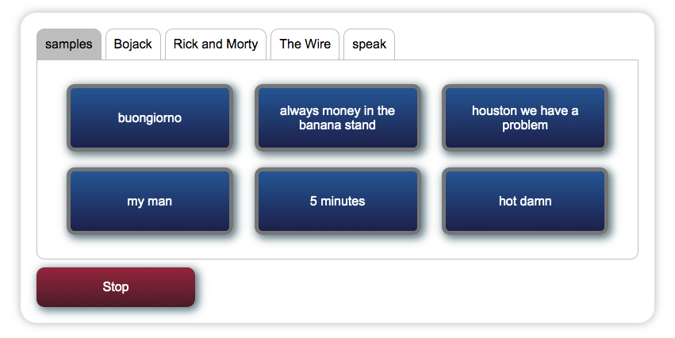

# funboard
Most soundboards let you play amusing sounds on your own computer. The funboard lets other people play sounds on your computer. Using the magic of Flask, it opens unsecured endpoints that others can use to play arbitarily absurd sounds on the host computer. It's great for office environments.


Will play .mp3 samples placed in the `samples/` folder.
Creating subfolders in `samples/` results in tabs in the interface.
Requires `mpg321` to play mp3s and `espeak` for text to voice.


# Installation
To install, first clone the repo
```
git clone https://github.com/mgrau/funboard
```
then execute the install script. It downloads all required python and npm packages.
```
cd funboard
./install.sh
venv/bin/gunicorn -b 0.0.0.0:80 server.server:app
```
